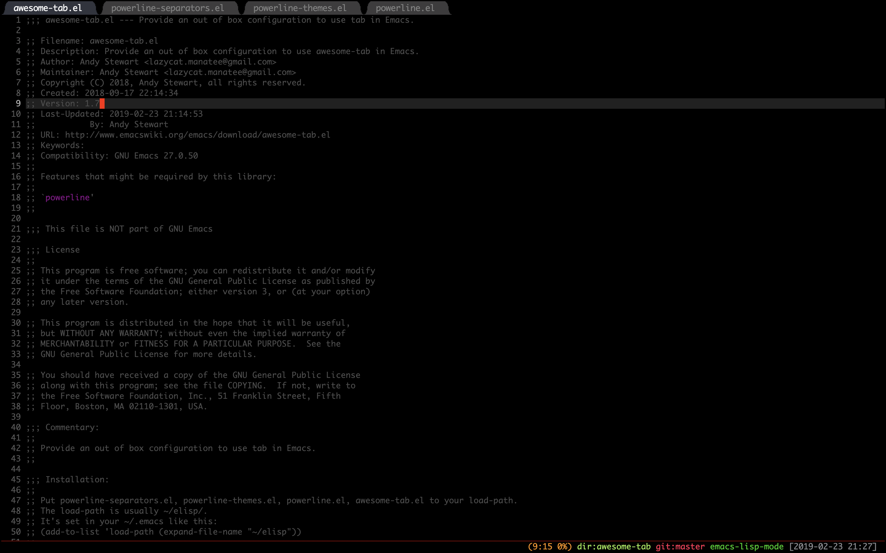

Table of Contents
=================

* [What is it?](#what-is-it)
     * [Installation](#installation)
     * [Usage](#usage)
     * [Plugins](#plugins)
     * [Customize](#customize)
        * [Theme](#theme)
        * [HideRules](#hiderules)
        * [GroupRules](#grouprules)


# What is it?

Emacs package to provide out-of-the-box configuration to use tabs.

### Installation

1. Clone this repository

```
git clone --depth=1 https://github.com/manateelazycat/awesome-tab.git
```

2. Move powerline-separators.el, powerline-themes.el, powerline.el, awesome-tab.el to your load-path.

    The load-path is usually `~/elisp/`.

    It's set in your `~/.emacs` or `~/.emacs.d/init.el` like this:

```Elisp
(add-to-list 'load-path (expand-file-name "~/elisp"))

(require 'awesome-tab)

(awesome-tab-mode t)
```

2. If you are using [Use-packge](https://github.com/jwiegley/use-package), the configuration will look like this

```ELisp
(use-package awesome-tab
  :load-path "path/to/your/awesome-tab.el"
  :config
  (awesome-tab-mode t)
)
```

3. Reload your emacs configuration using `M-x eval-buffer` or restarting emacs


### Usage

| Command                                         | Description                                                                           |
| :--------                                       | :----                                                                                 |
| awesome-tab-switch-group                        | Switch awesome-tab group by ido fuzz match                                            |
| awesome-tab-select-beg-tab                      | Select first tab of current group                                                     |
| awesome-tab-select-end-tab                      | Select last tab of current group                                                      |
| awesome-tab-forward-tab-other-window            | Select next tab in other window                                                       |
| awesome-tab-backward-tab-other-window           | Select previous tab in other window                                                   |
| awesome-tab-backward-tab                        | Select the previous available tab                                                     |
| awesome-tab-forward-tab                         | Select the next available tab                                                         |
| awesome-tab-backward-group                      | Go to selected tab in the previous available group                                    |
| awesome-tab-forward-group                       | Go to selected tab in the next available group                                        |
| awesome-tab-backward                            | Select the previous available tab, depend on setting of ```awesome-tab-cycle-scope``` |
| awesome-tab-forward                             | Select the next available tab, depend on setting of ```awesome-tab-cycle-scope```     |
| awesome-tab-kill-other-buffers-in-current-group | Kill other buffers of current group                                                   |
| awesome-tab-kill-all-buffers-in-current-group   | Kill all buffers of current group                                                     |
| awesome-tab-kill-match-buffers-in-current-group | Kill buffers match extension of current group                                         |
| awesome-tab-keep-match-buffers-in-current-group | Keep buffers match extension of current group                                         |
| awesome-tab-move-current-tab-to-left            | Move current tab to left                                                              |
| awesome-tab-move-current-tab-to-right           | Move current tab to right                                                             |


### Plugins
If you're helm fans, you need add below code in your helm config,

Then add ```helm-source-awesome-tab-group``` in ```helm-source-list```

```Elisp
(awesome-tab-build-helm-source)
```

Ivy fans can use ```awesome-tab-build-ivy-source```

### Customize

#### Theme

| Option                  | Description                |
| :--------               | :----                      |
| awesome-tab-background-color | Background color of awesome-tab |
| awesome-tab-selected     | Active tab color           |
| awesome-tab-unselected   | Inactive tab color         |

##### HideRules
Awesome tab hide some tabs with regular expression that controller by function ```awesome-tab-hide-tab-function```

Default hide function is ```awesome-hide-tab```

```Elisp
(defun awesome-tab-hide-tab (x)
  (let ((name (format "%s" x)))
    (and
     (not (string-prefix-p "*epc" name))
     (not (string-prefix-p "*helm" name))
     (not (string-prefix-p "*Compile-Log*" name))
     (not (string-prefix-p "*lsp" name))
     (not (and (string-prefix-p "magit" name)
               (not (file-name-extension name))))
     )))
```

Tab will hide if ```awesome-tab-hide-tab-function``` return nil, you can write your own code to customize hide rules.

##### GroupRules
Awesome tab use ```awesome-tab-buffer-groups-function``` to control tab group.
Default group function is ```awesome-tab-buffer-groups```

```Elisp
(defun awesome-tab-buffer-groups ()
  "`awesome-tab-buffer-groups' control buffers' group rules.

Group awesome-tab with mode if buffer is derived from `eshell-mode' `emacs-lisp-mode' `dired-mode' `org-mode' `magit-mode'.
All buffer name start with * will group to \"Emacs\".
Other buffer group by `awesome-tab-get-group-name' with project name."
  (list
   (cond
    ((or (string-equal "*" (substring (buffer-name) 0 1))
         (memq major-mode '(magit-process-mode
                            magit-status-mode
                            magit-diff-mode
                            magit-log-mode
                            magit-file-mode
                            magit-blob-mode
                            magit-blame-mode
                            )))
     "Emacs")
    ((derived-mode-p 'eshell-mode)
     "EShell")
    ((derived-mode-p 'emacs-lisp-mode)
     "Elisp")
    ((derived-mode-p 'dired-mode)
     "Dired")
    ((memq major-mode '(org-mode org-agenda-mode diary-mode))
     "OrgMode")
    (t
     (awesome-tab-get-group-name (current-buffer))))))
```

This function is very simple switch logic, you can write your own code to group tabs.

##### OrderRules
When switch tabs, if the two tabs are not adjacent before and after the switching action,
AwesomeTab will aggregate the two tabs by ```awesome-tab-adjust-buffer-order-function``` for the next quick switch.

Default functions is ```awesome-tab-adjust-buffer-order``` , you can write your own rule.

```Elisp
(defun awesome-tab-adjust-buffer-order ()
  "Put the two buffers switched to the adjacent position after current buffer changed."
  ;; Just continue when buffer changed.
  (when (and (not (eq (current-buffer) awesome-tab-last-focus-buffer))
             (not (minibufferp)))
    (let* ((current (current-buffer))
           (previous awesome-tab-last-focus-buffer)
           (current-group (first (funcall awesome-tab-buffer-groups-function))))
      ;; Record last focus buffer.
      (setq awesome-tab-last-focus-buffer current)

      ;; Just continue if two buffers are in same group.
      (when (eq current-group awesome-tab-last-focus-buffer-group)
        (let* ((bufset (awesome-tab-get-tabset current-group))
               (current-group-tabs (awesome-tab-tabs bufset))
               (current-group-buffers (mapcar 'car current-group-tabs))
               (current-buffer-index (cl-position current current-group-buffers))
               (previous-buffer-index (cl-position previous current-group-buffers)))

          ;; If the two tabs are not adjacent, swap the positions of the two tabs.
          (when (and current-buffer-index
                     previous-buffer-index
                     (> (abs (- current-buffer-index previous-buffer-index)) 1))
            (let* ((copy-group-tabs (copy-list current-group-tabs))
                   (previous-tab (nth previous-buffer-index copy-group-tabs))
                   (current-tab (nth current-buffer-index copy-group-tabs))
                   (base-group-tabs (awesome-tab-remove-nth-element previous-buffer-index copy-group-tabs))
                   (new-group-tabs
                    (if (> current-buffer-index previous-buffer-index)
                        (awesome-tab-insert-before base-group-tabs current-tab previous-tab)
                      (awesome-tab-insert-after base-group-tabs current-tab previous-tab))))
              (set bufset new-group-tabs)
              (awesome-tab-set-template bufset nil)
              (awesome-tab-display-update)
              ))))

      ;; Update the group name of the last access tab.
      (setq awesome-tab-last-focus-buffer-group current-group)
      )))
```      
